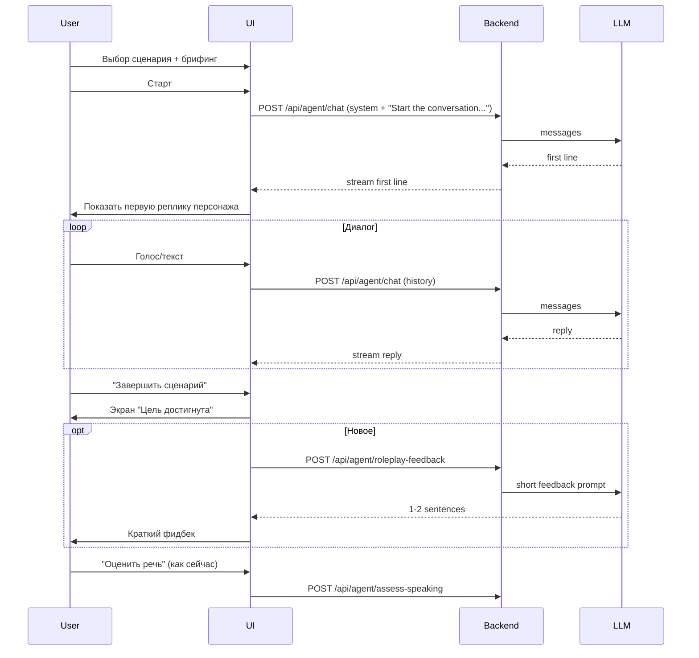

# Улучшение ролевых сценариев: погружение и педагогический эффект

## Текущее состояние (что «сыро»)

- **Промпты**: Жёсткие списки «Rules:», «Speak only in English», «1–2 sentences» — дают ровного, предсказуемого персонажа без характера. Recast и адаптация к уровню уже есть в [frontend/lib/roleplay.ts](frontend/lib/roleplay.ts) (ADAPT_TO_LEVEL_INSTRUCTION, PEER_SLANG), но системные промпты сценариев задают тон «инструкция», а не «живой собеседник».
- **Первая реплика**: Старт диалога инициируется фейковым сообщением пользователя «Start the conversation. Say your first line as your character.» ([AgentTab.tsx](frontend/components/tabs/AgentTab.tsx) ~550). Модель придумывает первую фразу сама — часто получается общая, без контекста места/ситуации.
- **Цель**: «Цель достигнута» показывается только по кнопке «Завершить сценарий»; автоопределения достижения цели по репликам нет.
- **Педагогика после сценария**: Есть только отдельная кнопка «Оценить речь» (assess-speaking) и экран с критериями. Нет короткого автоматического фидбека «что было хорошо / что попробовать в следующий раз» прямо после завершения.
- **Данные сценариев**: Один `suggestedFirstLine`, нет явной первой фразы персонажа, нет сложности/вариативности (например, необязательный поворот сюжета).

Ниже — конкретные шаги по доработке.

---

## 1. Промпты: от «правил» к характеру и естественному диалогу

**Где менять:** [frontend/data/roleplay-scenarios.json](frontend/data/roleplay-scenarios.json) — поле `systemPrompt` у каждого сценария; глобальные инструкции в [frontend/lib/roleplay.ts](frontend/lib/roleplay.ts) (buildScenarioSystemContent, ADAPT_TO_LEVEL, GOAL_COMPLETION).

**Идея:** Переписать системные промпты в формате «персонаж + контекст + стиль речи», а не «Rules: 1. 2. 3.»

**Рекомендуемая структура одного systemPrompt:**

- **Character (1–2 предложения):** Кто ты, имя/роль, одна характерная черта или фраза (например: «You are Mike, a taxi driver. You’re friendly but a bit in a hurry.»).
- **Situation:** Где происходит разговор и что только что произошло (звонок, пользователь зашёл в кафе и т.д.).
- **Your goal as character:** Что персонаж хочет получить от разговора (узнать адрес, продать стрижку и т.д.).
- **How to talk:** Коротко: короткие реплики, только на целевом языке, подтверждать услышанное, при мелкой ошибке пользователя — естественно вплетать правильную форму (recast), не говорить «You should say». При затруднении — предлагать выбор/подсказку.
- **First line:** Явная инструкция: «Your first line should [конкретика].» Например: «Your first line should sound like answering a phone: e.g. «Yellow cabs, hello? Where to?»» — чтобы первая реплика погружала в ситуацию.

**Глобальные дополнения в roleplay.ts:**

- В **GOAL_COMPLETION_INSTRUCTION** оставить завершение одной короткой фразой без мета-комментариев.
- Добавить блок **Natural dialogue**: использовать backchannels (yeah, mm-hmm, right), иногда переформулировать сказанное пользователем; реагировать на короткие/неполные реплики («I… I need a taxi» → «No problem, take your time. Where from?»); не выдавать длинные монологи; варьировать длину ответа в зависимости от того, как говорит пользователь (уже частично есть через ADAPT_TO_LEVEL — усилить формулировкой «vary your reply length and complexity based on the user’s last message»).

**Итог по промптам:** Единый шаблон для всех сценариев (опционально вынести шаблон в код и подставлять поля из JSON), плюс 1–2 пилотных сценария (например, такси + друг) переписать полностью и сравнить поведение.

---

## 2. Данные сценариев: новые поля и контент

**Файлы:** [frontend/lib/roleplay.ts](frontend/lib/roleplay.ts) (типы), [frontend/data/roleplay-scenarios.json](frontend/data/roleplay-scenarios.json) (данные).

**Предлагаемые поля (все опциональные):**

| Поле                  | Тип      | Назначение                                                                                                                                                  |
| --------------------- | -------- | ----------------------------------------------------------------------------------------------------------------------------------------------------------- |
| `characterOpening`    | string   | Жёсткая или эталонная первая фраза персонажа (если задана — можно подставлять в промпт или даже показывать как первую реплику без вызова LLM для «старта»). |
| `openingInstruction`  | string   | Текст только для промпта: как именно начать (например: «Answer the phone and ask where they need to go.»).                                                  |
| `suggestedFirstLines` | string[] | Несколько вариантов первой фразы пользователя вместо одного `suggestedFirstLine` (UI: показывать один случайный или все).                                   |
| `difficulty`          | 'easy'   | 'medium'                                                                                                                                                    |
| `optionalTwist`       | string   | Подсказка для модели: необязательный поворот (например: «If the user hesitates, the «hotel» can say they have one last room at a discount.»).               |

В **roleplay.ts** добавить эти поля в интерфейс `RoleplayScenario` и при сборке system-контента использовать `openingInstruction` / `characterOpening` там, где они заданы. В брифинге ([RoleplayModeUI.tsx](frontend/components/roleplay/RoleplayModeUI.tsx)) показывать `suggestedFirstLines[0]` или список, если массив есть.

---

## 3. Старт диалога: более погружающая первая реплика

**Сейчас:** В [AgentTab.tsx](frontend/components/tabs/AgentTab.tsx) при старте сценария отправляется одна пользовательская реплика: «Start the conversation. Say your first line as your character.» — модель генерирует первую фразу.

**Варианты улучшения:**

- **A)** В системный промпт всегда добавлять явный блок «Your first line: …» (из `openingInstruction` или шаблона по типу сценария). Оставить текущий механизм (один запрос с «Start the conversation»), но модель будет следовать конкретной инструкции.
- **B)** Если в сценарии задано `characterOpening`, при старте не вызывать LLM, а сразу показать эту фразу как первую реплику ассистента и ждать ответа пользователя. Меньше задержка, полный контроль над погружением.

Рекомендация: сделать **A** для всех сценариев (через промпт), **B** — опционально для части сценариев с фиксированной «визиткой» (например, «Yellow cabs, hello?»).

---

## 4. Завершение сценария и автоопределение цели

**Сейчас:** Пользователь сам нажимает «Завершить сценарий» → показывается экран «Цель достигнута» ([AgentTab.tsx](frontend/components/tabs/AgentTab.tsx) ~1586–1676).

**Улучшения:**

- **Ручное завершение оставить** как основной способ (надёжно и предсказуемо).
- **Опционально — авто-подсказка:** после каждой реплики ассистента (или только если реплика короткая и похожа на прощание) вызывать лёгкий классификатор: «Is this a natural closing line for the scenario?» (отдельный маленький запрос к LLM или эвристика по длине/ключевым словам). Если да — показать плашку «Похоже, цель достигнута. Завершить сценарий?» с кнопками «Да» / «Продолжить». Это улучшит ощущение естественности без обязательной автоматической смены экрана.

Реализация авто-подсказки: либо отдельный endpoint (например `POST /api/agent/check-goal-reached` с последними 1–2 сообщениями + scenario goal), либо в клиенте после получения chunk/done по stream вызывать проверку. Порог срабатывания лучше делать консервативным, чтобы не показывать «Цель достигнута» слишком рано.

---

## 5. Педагогический фидбек после сценария

**Цель:** Дать пользователю быстрый, понятный фидбек сразу после «Цель достигнута», не заменяя полную «Оценку речи».

**Варианты:**

- **Короткий автофидбек от AI:** На экране «Цель достигнута» после загрузки показать 1–2 предложения от модели по диалогу: что получилось хорошо, что попробовать в следующий раз (например: «You used «I’d like to…» well. Next time try asking about the price in one full sentence.»). Запрос: один вызов LLM с системным промптом «You are a supportive language coach. Given the dialogue transcript (user messages only) and the scenario, write 1–2 short sentences: one strength, one concrete suggestion. In Russian or English. No scoring.» + последние N реплик пользователя.
- **Интеграция с оценкой:** Оставить кнопку «Оценить речь» как есть; под ней добавить текст-подсказку: «Рекомендуем получить полную оценку по критериям» — чтобы пользователь понимал связь между коротким фидбеком и развёрнутой оценкой.

Технически: новый endpoint `POST /api/agent/roleplay-feedback` (messages, scenario_id, scenario_title) или расширение ответа при «Завершить сценарий» не подходит (завершение — действие на клиенте). Лучше запрашивать короткий фидбек при открытии экрана «Цель достигнута» (один раз), сохранять в state и показывать под заголовком «Цель достигнута».

---

## 6. Сводка по приоритетам

- **Высокий приоритет (максимум погружения при минимуме риска):**  
  - Переписать системные промпты по шаблону «персонаж + ситуация + цель + стиль + первая реплика» и добавить блок «Natural dialogue» в [roleplay.ts](frontend/lib/roleplay.ts).  
  - Добавить в сценарии `openingInstruction` (и по желанию `characterOpening`) и использовать их при сборке промпта и при старте диалога.
- **Средний приоритет:**  
  - Новые поля в сценариях: `suggestedFirstLines[]`, `difficulty`, `optionalTwist`; обновить UI брифинга.  
  - Короткий педагогический фидбек на экране «Цель достигнута» (новый endpoint + вызов при показе экрана).
- **Низкий приоритет:**  
  - Опциональная авто-подсказка «Завершить сценарий?» по реплике ассистента.  
  - Опция выбора уровня (A1–C1) в UI и передача в system как hint.

---

## Схема потока (как сейчас и что меняется)

После внедрения промптов и опционально «первой реплики» из данных сценарий будет ощущаться более живым; короткий фидбек и опциональная подсказка «Цель достигнута?» усилят педагогический эффект без перегрузки интерфейса.

---

## 7. Что реализовать для усовершенствования плана

Конкретные шаги, которые усиливают и педагогику, и развлекательный формат. Упорядочено по приоритету и объёму работ.

### 7.1 Высокий приоритет (быстро, сильный эффект)

- **Фильтр сложности в модалке сценариев**  
В [RoleplayModeUI.tsx](frontend/components/roleplay/RoleplayModeUI.tsx) (ScenarioModal): добавить сегментированный фильтр «Все / Лёгкие / Средние / Сложные» по полю `difficulty`; фильтровать список сценариев до передачи в секции по темам. На карточке сценария ([ScenarioCard](frontend/components/roleplay/RoleplayModeUI.tsx)) показывать бейдж Easy / Medium / Hard по `scenario.difficulty`.
- **Улучшить промпт короткого фидбека**  
В [backend/src/index.js](backend/src/index.js) в `POST /api/agent/roleplay-feedback`: принимать в теле запроса `goal` или `goalRu` (из сценария). В системном промпте явно просить: (1) одну конкретную сильную сторону с отсылкой к фразе/действию пользователя; (2) одно конкретное предложение на следующий раз, привязанное к цели сценария. Опционально в промпте попросить вернуть одно поле `useful_phrase` — типичную конструкцию для этой ситуации; на фронте показывать под фидбеком блок «Запомни: …».
- **Явная первая реплика везде, где возможно**  
В [roleplay-scenarios.json](frontend/data/roleplay-scenarios.json): для сценариев без `characterOpening` заполнить его по образцу уже переписанных (такси, отель, ресторан). В [roleplay.ts](frontend/lib/roleplay.ts) в `buildScenarioSystemContent` гарантировать, что при отсутствии `characterOpening` в промпт всегда попадает блок «First line: …» из `openingInstruction`, чтобы при старте через LLM первая реплика была предсказуемой.

### 7.2 Средний приоритет (средний объём, заметный эффект)

- **Подсказка «Цель достигнута?»**  
Новый endpoint `POST /api/agent/check-goal-reached`: тело `{ messages: last 2–4 messages, goal: string }`, ответ `{ reached: boolean }` — один короткий запрос к LLM («Is this a natural closing for this scenario goal? Yes/No.»). В [AgentTab.tsx](frontend/components/tabs/AgentTab.tsx) после получения ответа ассистента (в stream/done): при `reached === true` показывать плашку «Похоже, цель достигнута. Завершить сценарий?» с кнопками «Да» / «Продолжить». Вызов делать консервативно (например, только если последняя реплика ассистента короткая или содержит ключевые слова прощания), чтобы не спамить.
- **Мини-итог от персонажа после «Цель достигнута»**  
Новый endpoint `POST /api/agent/character-closing` или расширение ответа `roleplay-feedback`: один запрос к LLM — «In one short sentence, in character, say a natural goodbye or wrap-up for this scenario.» Показать на экране «Цель достигнута» под заголовком или над фидбеком (одна фраза в кавычках, курсивом) — для эмоционального замыкания.
- **Блок «Полезные фразы» на экране «Цель достигнута»**  
Либо расширить ответ `roleplay-feedback`: в промпте просить вернуть 1–2 «полезные фразы/конструкции для этой ситуации» (JSON или отдельные строки). Либо отдельный лёгкий запрос «extract 1–2 key phrases for this scenario type». В [AgentTab.tsx](frontend/components/tabs/AgentTab.tsx) на экране goal-reached под фидбеком вывести блок «Запомни на будущее: …» (без перегрузки, 1–2 фразы).

### 7.3 Низкий приоритет (геймификация и метрики)

- **Прогресс по сценариям**  
При нажатии «Завершить сценарий» сохранять в БД факт завершения: новая таблица `roleplay_completions (user_id, scenario_id, completed_at)` или поле в `agent_sessions`. В модалке выбора сценария на карточке показывать иконку/метку «Пройден» для сценариев, которые пользователь уже завершал. Опционально: счётчик «Пройдено: N сценариев» в шапке модалки или в профиле.
- **Достижения (бейджи)**  
Счётчики: первый завершённый диалог, 5 сценариев, все сценарии одной темы (например, taxi). Хранить в таблице достижений или в профиле пользователя. Показывать ненавязчиво: иконка/бейдж в углу модалки сценариев или на экране «Цель достигнута» («Получено: Первый диалог»). Без тяжёлых попапов.
- **Связь оценки речи с целью сценария**  
В [backend/src/index.js](backend/src/index.js) в `POST /api/agent/assess-speaking`: принимать `goal` или `goalRu`. В системном промпте рубрики добавить: при оценке `completeness` и `dialogue_skills` учитывать, насколько пользователь достиг цели сценария. Ответ API не менять (тот же JSON с критериями), только улучшить качество оценок.

### 7.4 Чек-лист по файлам

| Задача                                    | Файлы                                                                |
| ----------------------------------------- | -------------------------------------------------------------------- |
| Фильтр сложности + бейдж на карточке      | `RoleplayModeUI.tsx`                                                 |
| Улучшение фидбека (goal + полезная фраза) | `backend/src/index.js`, опционально `AgentTab.tsx`                   |
| characterOpening / First line везде       | `roleplay-scenarios.json`, `roleplay.ts`                             |
| Подсказка «Цель достигнута?»              | `backend/src/index.js` (новый route), `AgentTab.tsx`                 |
| Итог от персонажа                         | `backend/src/index.js`, `AgentTab.tsx`                               |
| Полезные фразы на экране завершения       | `backend/src/index.js` (расширить roleplay-feedback), `AgentTab.tsx` |
| Прогресс по сценариям                     | Supabase migration, `AgentTab.tsx`, `RoleplayModeUI.tsx`             |
| Достижения                                | Supabase (опционально), `AgentTab.tsx` или отдельный компонент       |
| Оценка с учётом цели                      | `backend/src/index.js` (assess-speaking)                             |

